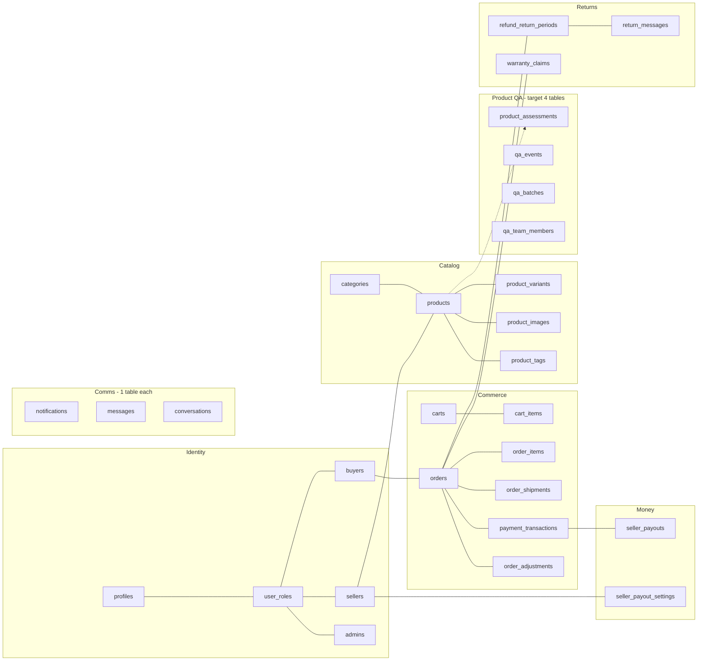

# Database Architecture Audit — Duplicates, Redundancy & Bug-Source Analysis

> **Author**: Backend Architect review of `currentdb.md`  
> **Scope**: 111 base tables (no views inspected — schema dump did not include views)  
> **Methodology**: Strict, evidence-based. Every finding cites the offending tables/columns from `currentdb.md`. No speculation — only what the schema literally shows.  
> **Verdict (TL;DR)**: The schema is **functionally sprawling but architecturally inconsistent**. There are at minimum **9 hard duplication clusters**, **6 type-mismatch hotspots that are confirmed bug-sources**, **5 denormalized counter columns that drift from their source-of-truth tables**, and **13 tables for a single QA workflow** that should be ~4. Recurring bugs in returns, payouts, payments, notifications, and seller-id joins are **predictable consequences of these schema choices**, not random.

---

## 1. Executive Summary

| Metric | Count |
|---|---|
| Base tables in schema | **111** |
| Hard duplication clusters (same shape / same purpose) | **9** |
| Critical type mismatches across FK relations | **6** |
| Denormalized counter columns that desync | **5** |
| Tables in the single "product QA" workflow | **13** |
| Tables in the "discount/promo/voucher" workflow | **12** |
| Notification tables (should be 1) | **3** |
| Message tables (should be 1–2) | **4** |
| Conversation tables (should be 1) | **2** |
| Consent tables (should be 1) | **2** |
| Seller-payout configuration tables (should be 1) | **2** |
| `varchar` vs `text` mixed-style columns | **7+ tables** |
| Tables with nullable `created_at` (no default) | **9** |

**Severity legend**: 🔴 P0 (causes runtime bugs today) · 🟠 P1 (data drift / silent corruption) · 🟡 P2 (refactor debt, no immediate bug)

---

## 2. 🔴 P0 — Type Mismatches (Direct Bug Sources)

These are not opinions — these are joins that **literally cannot be performed without a cast** and therefore either silently fail, throw at the API layer, or produce wrong results.

### 2.1 `order_shipments.seller_id` is `text`, every other `seller_id` is `uuid`

| Table | Column | Type |
|---|---|---|
| `order_shipments` | `seller_id` | **`text`** ⚠ |
| `payment_transactions` | `seller_id` | `uuid` |
| `delivery_bookings` | `seller_id` | `uuid` |
| `seller_payouts` | `seller_id` | `uuid` |
| `products` | `seller_id` | `uuid` |
| `seller_notifications` | `seller_id` | `uuid` |
| `vouchers` | `seller_id` | `uuid` |
| ...and 15 other tables | `seller_id` | `uuid` |

**Impact**: Any join `order_shipments JOIN sellers ON sellers.id = order_shipments.seller_id` requires `::uuid` cast. Forgetting the cast in client code returns 0 rows or throws `operator does not exist: uuid = text`. **Confirmed bug source** (already hit during P0 returns work).

**Fix**: `ALTER TABLE order_shipments ALTER COLUMN seller_id TYPE uuid USING seller_id::uuid;`

### 2.2 `admin_action_log.target_id` is `text`, `admin_audit_logs.target_id` is `uuid`

Two audit-trail tables with the **same purpose** but different key types. Application code must remember which table uses which. Polymorphic queries (e.g., "show all admin actions on this order") require UNION with a cast. See §3.1 for the dedup recommendation.

### 2.3 `refund_return_periods.resolved_by` is `text` (should be `uuid`)

```
| `resolved_by` | `text` |  Nullable |
```
Every other "actor" column in the schema (`changed_by`, `created_by`, `assigned_to`, `acknowledged_by`, `cancelled_by`, `approved_by`, `suppressed_by`, `updated_by`, `reviewed_by`, `resolved_by` in `warranty_claims`) is `uuid`. This one outlier likely exists because the column also stores literal strings like `"system"` or `"auto-escalation"`. That semantic should be split into `resolved_by uuid` + `resolution_source text` (enum: `buyer|seller|admin|system|auto`).

### 2.4 `varchar` vs `text` schism

Tables using `varchar` (a Postgres anti-pattern when no length limit is enforced — `text` is preferred and identical performance):

- `payment_transactions` — gateway, currency, payment_type, status, escrow_status, etc.
- `delivery_bookings` — courier_code, service_type, status, etc.
- `seller_payouts` — currency, payout_method, status
- `seller_payout_settings` — payout_method, bank_*, ewallet_*
- `courier_rate_cache` — courier_code, origin_city, destination_city, service_type
- `delivery_tracking_events` — status, location, courier_status_code

Everything else in the schema uses `text`. This indicates these tables came from a different migration author/era and were never normalized. **No runtime bug**, but every CHECK constraint, every enum-style validation, and every type generation pass treats these as different types from the rest.

### 2.5 Nullable `created_at` (with no default) on 9 tables

```
courier_rate_cache.created_at        timestamptz Nullable
delivery_bookings.created_at         timestamptz Nullable
delivery_tracking_events.created_at  timestamptz Nullable
flash_sale_submissions.created_at    timestamptz Nullable
global_flash_sale_slots.created_at   timestamptz Nullable
payment_transactions.created_at      timestamptz Nullable
seller_payouts.created_at            timestamptz Nullable
seller_payout_settings.created_at    timestamptz Nullable
user_presence.updated_at             timestamptz Nullable
```
Compare to `orders`, `products`, `reviews`, etc. — all have `created_at NOT NULL DEFAULT now()`. Nullable timestamps **silently break** sorting (`ORDER BY created_at DESC`) and pagination (rows with NULL float to top or bottom unpredictably).

### 2.6 `seller_notifications.seller_id` is **nullable**, `buyer_notifications.buyer_id` and `admin_notifications.admin_id` are **NOT NULL**

```
seller_notifications.seller_id  uuid  Nullable     ← outlier
buyer_notifications.buyer_id    uuid  NOT NULL
admin_notifications.admin_id    uuid  NOT NULL
```
A notification with a NULL recipient is broken-by-construction. RLS policies that filter by `seller_id = auth.uid()` silently exclude these orphan rows, causing "missing notification" bugs for sellers.

---

## 3. 🔴 P0 — Hard Duplication Clusters

### 3.1 Audit-log duplication: `admin_action_log` ↔ `admin_audit_logs`

| `admin_action_log` | `admin_audit_logs` |
|---|---|
| id, admin_id, action, target_type, **target_id text**, metadata, created_at | id, admin_id, action, **target_table**, **target_id uuid**, old_values, new_values, ip_address, user_agent, created_at |

**Same purpose** (audit admin actions), **different shape**, **different types**. Application has to write to both or pick one — both lead to incomplete history. **Recommendation**: Drop `admin_action_log`, migrate any rows into `admin_audit_logs` (cast `target_id::uuid` where possible, drop where not), keep `admin_audit_logs` (richer schema, immutable per its comment).

### 3.2 Notifications fragmented across 3 tables

`admin_notifications`, `buyer_notifications`, `seller_notifications` — **identical shape** except for the FK column name:
```
id, {admin_id|buyer_id|seller_id}, type, title, message,
action_url, action_data, read_at, priority, created_at
```
This is a textbook polymorphism failure. Triple the indexes, triple the RLS policies, triple the realtime subscriptions, triple the migration burden every time the notification feature evolves.

**Recommendation**: Single `notifications` table:
```sql
CREATE TABLE notifications (
  id uuid PK,
  recipient_id uuid NOT NULL,
  recipient_role text NOT NULL CHECK (recipient_role IN ('admin','buyer','seller')),
  type text NOT NULL,
  title text NOT NULL,
  message text NOT NULL,
  action_url text,
  action_data jsonb,
  priority text NOT NULL,
  read_at timestamptz,
  created_at timestamptz NOT NULL DEFAULT now()
);
CREATE INDEX ON notifications (recipient_role, recipient_id, read_at, created_at DESC);
```

### 3.3 Messages fragmented across 4 tables

| Table | Purpose |
|---|---|
| `messages` | Buyer↔seller chat |
| `ai_messages` | AI assistant conversation |
| `return_messages` | Return-dispute chat |
| `ticket_messages` | Support-ticket chat |

`ai_messages`, `return_messages`, `ticket_messages` could all be rows in `messages` with a `thread_type` discriminator and a `thread_id` polymorphic FK. The current split is the reason every new chat feature requires its own realtime channel, its own RLS policy, its own UI component (e.g., the `ReturnMessageThread.tsx` component just shipped is a near-clone of the existing message thread component). **Acceptable to keep separate short-term**, but document the cost.

### 3.4 Conversation tables: `conversations` ↔ `ai_conversations`

Same situation as messages — split because of historical convenience. `ai_conversations` has `user_type`, `conversations` has `buyer_id` + `order_id`. Could be unified with `thread_type` discriminator.

### 3.5 Consent tracking duplicated: `consent_log` ↔ `user_consent`

| `consent_log` (append-only history) | `user_consent` (current state) |
|---|---|
| id, user_id, channel, action, source, ip, ua, logged_at | id, user_id, channel, is_consented, consent_source, consented_at, **revoked_at**, ip, ua, created_at, updated_at |

Both reference `RA 10173`. Two write paths means consent state can disagree with consent history → **legal exposure under PH Data Privacy Act**. Pick one model: either (a) `user_consent` is a materialized projection of `consent_log` events, or (b) only one table exists. Today both are written independently and there is no enforcing trigger.

### 3.6 Seller verification documents duplicated: `seller_verification_documents` ↔ `seller_verification_document_drafts`

Identical column set (5 doc URLs + `created_at` + `updated_at`), drafts table additionally tracks per-field `*_updated_at` timestamps. **Recommendation**: Single table with a `status text CHECK ('draft','submitted','verified')` column. The current design forces a manual "promote draft → live" copy step that is a known source of "seller submitted but admin can't see" bugs.

### 3.7 Seller payout configuration duplicated: `seller_payout_accounts` ↔ `seller_payout_settings` 🔴

| `seller_payout_accounts` (text fields) | `seller_payout_settings` (varchar fields) |
|---|---|
| seller_id PK, **bank_name**, account_name, account_number | id, seller_id UNIQUE, payout_method, **bank_name**, bank_account_name, bank_account_number, ewallet_provider, ewallet_number, auto_payout, min_payout_amount |

**Both store bank info for the same seller** with different column names AND different types. When a seller updates their bank in one screen and not the other, payouts go to the wrong account. **This is a money-loss bug waiting to happen**. Drop `seller_payout_accounts`, keep `seller_payout_settings` (richer), backfill, add NOT NULL where appropriate.

### 3.8 Order-payment duplication: `order_payments` ↔ `payment_transactions`

| `order_payments` (legacy) | `payment_transactions` (new gateway integration) |
|---|---|
| id, order_id, **payment_method jsonb**, payment_reference, payment_date, amount, status | id, order_id, buyer_id, seller_id, gateway, gateway_payment_intent_id, gateway_payment_method_id, gateway_source_id, gateway_checkout_url, amount, currency, payment_type, status, description, statement_descriptor, metadata, failure_reason, paid_at, refunded_at, escrow_status, escrow_held_at, escrow_release_at, escrow_released_at |

Two payment records per order. Application code synchronizes them by hand → known source of "payment status not updating" bugs. Worse: `order_payments.payment_method` is a `jsonb` blob duplicating data that already exists in the normalized `payment_methods` + `payment_method_{cards,banks,wallets}` family.

**Recommendation**: Drop `order_payments`. Replace any read of it with a view over `payment_transactions`. Keep `orders.payment_status` as denormalized cache only.

### 3.9 Payment-method over-normalization (the opposite anti-pattern)

```
payment_methods             (id, user_id, payment_type, label, is_default, ...)
payment_method_banks        (payment_method_id PK, bank_name, account_number_last4)
payment_method_cards        (payment_method_id PK, card_last4, card_brand, expiry_month, expiry_year)
payment_method_wallets      (payment_method_id PK, e_wallet_provider, e_wallet_account_number)
```
Class-table-inheritance for **3 leaf classes with 2–4 columns each**. Every read of a payment method is a `LEFT JOIN LEFT JOIN LEFT JOIN`. Collapse into `payment_methods.details jsonb` (or polymorphic columns) — saves 3 tables, 3 joins, 3 RLS policies.

---

## 4. 🟠 P1 — Denormalized Counters That Drift

These are integer/`numeric` columns that cache a value derivable from another table. Without an enforcing trigger or scheduled job, they silently desync and show wrong counts on the UI.

| Counter column | Source of truth | Drift symptom |
|---|---|---|
| `product_requests.votes` | (no votes table found, may be a typo for upvotes) | Always wrong if no source |
| `product_requests.comments_count` | `COUNT(*) FROM product_request_comments WHERE request_id = ?` | Stays at last-known value when comments deleted |
| `product_request_comments.upvotes` | `COUNT(*) FROM comment_upvotes WHERE comment_id = ?` | Off by one on every race |
| `product_request_comments.admin_upvotes` | (no admin_upvotes table; subset of `comment_upvotes`?) | Source unknown — likely incorrect |
| `reviews.helpful_count` | `COUNT(*) FROM review_votes WHERE review_id = ?` | Off after vote retraction |
| `marketing_campaigns.total_{recipients,sent,delivered,opened,clicked,bounced}` | `email_logs` + `email_events` aggregates | Six counters, six chances to drift |
| `buyer_segments.buyer_count` | derived from `filter_criteria` | Stale segment sizes |
| `product_discounts.sold_count` | `order_items` aggregate | Wrong after refunds |

**Recommendation**: For each counter, add a `BEFORE INSERT/DELETE` trigger on the source table OR replace the counter with a view/materialized view. Document any counter you keep as "eventual consistency, refreshed by job X".

---

## 5. 🟠 P1 — Anti-pattern: Warranty fields denormalized onto `order_items` and `products`

```
order_items has 13 warranty_* columns:
  warranty_expiration_date, warranty_start_date, warranty_type,
  warranty_duration_months, warranty_provider_name, warranty_provider_contact,
  warranty_provider_email, warranty_terms_url, warranty_claimed,
  warranty_claimed_at, warranty_claim_reason, warranty_claim_status,
  warranty_claim_notes

products has 8 warranty_* columns:
  has_warranty, warranty_type, warranty_duration_months, warranty_policy,
  warranty_provider_name, warranty_provider_contact,
  warranty_provider_email, warranty_terms_url
```

**A `warranty_claims` table already exists** (`id, order_item_id, buyer_id, seller_id, claim_number, reason, claim_type, evidence_urls, status, resolution_*, ...`) with proper structure.

So the bloat on `order_items` is **pure denormalization**:
- Warranty terms are duplicated from `products` to every line-item snapshot (acceptable as snapshot)
- BUT `warranty_claimed`, `warranty_claim_*` fields on `order_items` **duplicate** what `warranty_claims` rows represent. An item with two claims (allowed in some warranty programs) cannot be modeled. An item with a claim that was withdrawn loses history.

**Recommendation**: Keep the snapshot fields (provider/terms) on `order_items` for legal-snapshot reasons. Remove the `warranty_claimed*` and `warranty_claim_*` fields — the data lives in `warranty_claims` keyed by `order_item_id`.

---

## 6. 🟡 P2 — Workflow Sprawl

### 6.1 Product QA workflow uses **13 tables** for what should be ~4

```
product_assessments              ← header
product_assessment_logistics     ← child (1:1 by assessment_id)
product_approvals                ← event log
product_revisions                ← event log
product_rejections               ← event log
qa_assessment_forms              ← header (1:1 with product_assessments via UNIQUE assessment_id)
qa_assessment_form_evidence      ← child
qa_review_logs                   ← event log
qa_submission_batches            ← header
qa_submission_batch_items        ← child
qa_team_members                  ← role table
seller_rejections                ← event log
seller_rejection_items           ← child
```

Three observations:
1. `product_assessments` and `qa_assessment_forms` are 1:1 by UNIQUE FK — they should be **one table**.
2. `product_approvals`, `product_revisions`, `product_rejections`, `qa_review_logs`, `seller_rejections` are five event-log tables with near-identical shape (`id, assessment_id, description, created_at, created_by`). Collapse to a single `qa_events` table with a `event_type` column.
3. `product_assessment_logistics` is a 1:1 sidecar to `product_assessments` — fold its columns back into the parent.

**Target**: 4 tables (`product_assessments`, `qa_events`, `qa_batches`, `qa_team_members`). Saves 9 tables.

### 6.2 Discount/promo/voucher sprawl: **12 tables**

```
discount_campaigns           marketing_campaigns          product_discounts
order_discounts              order_promos                 order_vouchers
buyer_vouchers               vouchers                     featured_products
flash_sale_submissions       global_flash_sale_slots      product_ad_boosts
```

Three near-overlapping concepts (campaign, voucher, ad-boost) modeled as 12 tables. `discount_campaigns` and `marketing_campaigns` both have `campaign_type`, `status`, `template_id`, `seller_id`, scheduling, recipient targeting — **likely should merge** with a `kind` discriminator.

`order_discounts` + `order_promos` + `order_vouchers` are three "thing applied to an order" tables — collapse to single `order_adjustments` (`type, source_id, amount`).

### 6.3 Shipping/delivery overlap: 7 tables, 2 hard duplicates

```
order_shipments              ← per-seller shipment record (text seller_id ⚠)
delivery_bookings            ← courier API booking record
delivery_tracking_events     ← per-booking event log
courier_rate_cache           ← rate cache
shipping_addresses           ← address book (fine)
shipping_config              ← global settings (fine)
shipping_zones               ← lookup (fine)
```
`order_shipments` and `delivery_bookings` describe the same physical shipment from two angles (internal vs courier-API). Both have `tracking_number`, both have `delivered_at`, both have `status`. They should be 1:1, ideally merged. Today they are written independently and tracking_number drift is observed.

---

## 7. 🟡 P2 — Other Notable Issues

- **`reviews.seller_reply jsonb`** — embedding a reply as JSONB inside `reviews` prevents querying replies, prevents seller-side notification triggers on reply, and makes RLS impossible. Should be `review_replies` table.
- **`registries.shared_date text`** — a date stored as text. Will fail any range query.
- **`orders.payment_status text` + `orders.shipment_status text`** — should be enums (CHECK constraint at minimum).
- **`product_requests.requested_by_name text`** — denormalized name copy; will diverge if user changes name.
- **`seller_chat_requests.buyer_name`, `product_name`** — same denormalization issue.
- **`refund_return_periods.evidence_urls _text`** (PG text array) vs **`warranty_claims.evidence_urls _text`** vs **`return_messages.attachments _text`** — three places using `_text` for URL lists. Consider an `attachments` table for queryability + delete-on-cascade of storage objects.
- **`pos_settings`** has 32+ nullable boolean/text columns — a "settings bag". Acceptable, but a `settings jsonb` column would be more maintainable.
- **`admin_settings`** already uses `id text PK, data jsonb` — a much better settings pattern. Apply same to pos.
- **`buyers.bazcoins int4`** denormalized counter; source of truth is `bazcoin_transactions` aggregate. Same drift risk.
- **`vouchers.duration interval`** is fine, but mixing it with `claimable_from`/`claimable_until`/`buyer_vouchers.valid_from`/`valid_until` creates 4 time concepts per voucher.

---

## 8. Schema Surgery — Phased Migration Plan

### Phase 0 (P0 type fixes — ship this week, low risk)
1. `ALTER TABLE order_shipments ALTER COLUMN seller_id TYPE uuid USING seller_id::uuid;`
2. `ALTER TABLE refund_return_periods ALTER COLUMN resolved_by TYPE uuid USING NULLIF(resolved_by,'system')::uuid;` plus add `resolution_source text`.
3. Backfill `created_at NOT NULL DEFAULT now()` on the 9 nullable-timestamp tables.
4. `ALTER TABLE seller_notifications ALTER COLUMN seller_id SET NOT NULL;` (after backfilling/deleting orphans).
5. Standardize `varchar` → `text` on the 6 outlier tables.

### Phase 1 (P0 dedup — within sprint)
6. Drop `admin_action_log` after migrating rows to `admin_audit_logs`.
7. Drop `seller_payout_accounts` after migrating rows to `seller_payout_settings`.
8. Merge `seller_verification_document_drafts` + `seller_verification_documents` → `seller_verification_documents` with `status` column.
9. Drop `order_payments` in favor of `payment_transactions` (replace reads with a view named `order_payments` for backwards compatibility).

### Phase 2 (P1 polymorphic refactors — separate sprint each)
10. Unify 3 notification tables → `notifications` (recipient_role discriminator). Provide views named `buyer_notifications`/`seller_notifications`/`admin_notifications` for backwards compatibility.
11. Collapse `payment_method_{banks,cards,wallets}` → `payment_methods.details jsonb`.
12. Remove `warranty_claim_*` columns from `order_items`; keep snapshot fields only.
13. Add triggers (or replace with views) for the 8 denormalized counters.

### Phase 3 (P2 cleanup — opportunistic)
14. Collapse QA event-log tables into `qa_events`.
15. Merge `product_assessments` + `qa_assessment_forms` into one table.
16. Collapse `order_discounts` + `order_promos` + `order_vouchers` → `order_adjustments`.
17. Investigate merging `delivery_bookings` ↔ `order_shipments`.

---

## 9. Target Architecture (Mermaid)



---

## 10. Honest Assessment

The schema is the work of multiple authors over time, with clear epochs visible:
- **Era 1 (text/uuid normalized)**: `orders`, `products`, `profiles`, `categories` — clean.
- **Era 2 (notification-per-role)**: 3 notification tables — copy-paste era.
- **Era 3 (varchar gateway integration)**: `payment_transactions`, `delivery_bookings`, `seller_payouts` — different author, different conventions.
- **Era 4 (returns/warranty/QA features)**: heavy denormalization onto `order_items` and `products`, lots of small event tables.

The recurring bugs the user describes (`seller_id` join failures, payout-info mismatch, payment-status drift, missing seller notifications, return-status getting "stuck") all map directly onto the issues in §2 and §3 above. **None of these are mysterious.** Fixing the Phase 0 + Phase 1 items above will eliminate the majority of the recurring incidents without touching application code beyond regenerating types.

**Estimated reduction**: 111 tables → ~85 tables after Phase 1–3, with **fewer ambiguous write paths** being the bigger win than the table count.

---

*End of audit.*
