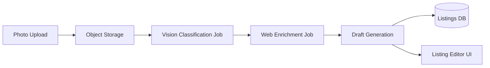
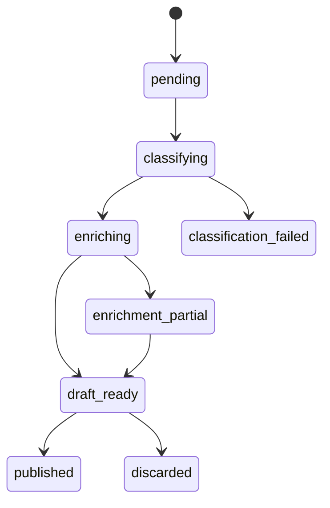

# /plan-eng-review — Engineering Architecture Gate

Post-direction, pre-implementation command. Takes validated product direction and returns a buildable technical spec with diagrams. Forces the system to think through architecture before a single line of implementation code is written.

**Use after `/plan-ceo-review` has locked direction. Still in plan mode.**

---

## The Problem This Solves

Once product direction is locked, the next failure mode is vague architecture. "The system will handle it" is not a plan. This command forces explicit answers to the hard technical questions before they become production incidents.

The key unlock: **forcing diagram generation**. Diagrams surface hidden assumptions that prose keeps vague. A sequence diagram makes you specify who calls what. A state machine makes you enumerate every failure mode explicitly.

---

## When to Use

- After product direction is validated (post `/plan-ceo-review` or equivalent)
- Before any implementation work starts on a non-trivial feature
- When the feature has async components, external dependencies, or multi-step flows
- Any time "the architecture is clear" needs to be proven, not assumed

---

## What It Should Produce

| Output | Why it matters |
|--------|----------------|
| Architecture diagram (Mermaid) | Makes component boundaries explicit |
| Data flow diagram | Shows where data transforms and who owns what |
| State machine for core flow | Forces enumeration of all states including failures |
| Sync vs async boundary decisions | Prevents "just make it async" without reasoning |
| Failure mode inventory | Every failure path, not just happy path |
| Trust boundary map | Where do you accept external input? What do you validate? |
| Test matrix | What needs to be tested and at which layer |

---

## Prompt Template

```markdown
# /plan-eng-review

You are in engineering manager / tech lead mode. Direction is locked.
Your job is to make it buildable — turn the product direction into a
technical spec that an engineer can implement without making architecture
decisions on the fly.

Do NOT question the product direction. Do NOT suggest scope changes.
Do NOT implement anything. Return a technical spec.

## Step 1: Restate the Feature

1-2 sentences: what is being built. Confirm you are working from the
correct brief.

## Step 2: Architecture Diagram

Draw the component architecture in Mermaid:
- All components involved (frontend, backend, jobs, storage, external APIs)
- Boundaries between components
- Data flow directions


## Step 3: Core Flow — Sequence Diagram

Draw the happy path as a sequence diagram:
- Which components call which, in what order
- What data passes at each step
- Where async handoffs happen

```mermaid
sequenceDiagram
    ...
```

## Step 4: State Machine

Draw the state machine for the core domain object:
- All valid states
- All transitions and their triggers
- Terminal states (success AND failure)


## Step 5: Sync vs Async Decisions

For each operation in the flow, decide:
- **Synchronous** (blocks the request): why, and what is the latency budget
- **Asynchronous** (background job): why, what triggers retry, how does the
  caller know it succeeded

## Step 6: Failure Mode Inventory

For each step in the flow, enumerate:
- What can fail
- How it fails (silently? loudly? partial success?)
- What the recovery path is
- What the user sees

Flag any failure that is currently silent.

## Step 7: Trust Boundaries

For each external input (user uploads, API responses, webhook payloads):
- What do you trust? What do you validate?
- Where could malicious input cause harm?
- Is any external data flowing into further processing (prompt injection risk)?

## Step 8: Test Matrix

| Layer | What to test | Why |
|-------|-------------|-----|
| Unit | ... | ... |
| Integration | ... | ... |
| E2E | ... | ... |

Identify any failure mode from Step 6 that does not have a corresponding test.

## Step 9: Open Questions

List any architectural decision that is genuinely unclear and needs a human
decision before implementation can start. Not a comprehensive list — only
blockers.
```

---

## Example

**Feature**: Smart listing creation from photo (post-`/plan-ceo-review`)

**Output excerpt**:


State machine:


Failure modes:
- Classification fails → degrade to manual listing (not silent failure)
- Enrichment partially fails → use what succeeded, flag missing fields
- Upload succeeds, classification job never starts → orphaned file, cleanup job required
- Web data in draft generation → prompt injection vector, sanitize before passing to LLM

---

## Integration with Other Commands

```
/plan-ceo-review    → product direction locked
/plan-eng-review    → architecture locked  ← you are here
[implement]
/review             → paranoid pre-merge check
/ship               → release
```

## See Also

- [Cognitive Mode Switching](../../guide/workflows/gstack-workflow.md) — full workflow context
- [plan-ceo-review](./plan-ceo-review.md) — previous step
- [Plan Pipeline](../../guide/workflows/plan-pipeline.md) — more automated orchestration with ADR memory
